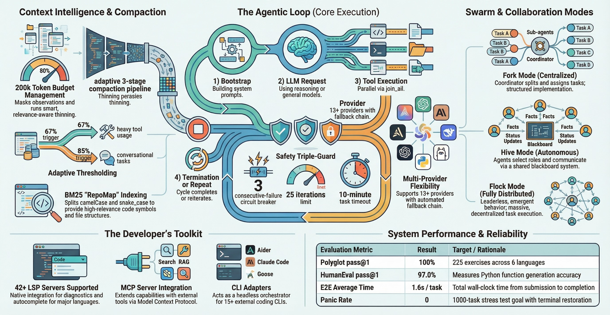

> **Nota:** Este documento ha sido traducido por IA y puede no ser 100 % exacto. Si encuentra algún error o tiene sugerencias de mejora, abra un problema en GitHub.

# <center>collet</center>

<center>
**Orquestrador de codificación agéntico implacable con bucles de agentes de caída cero.**

Orquestra cualquier LLM, cualquier agente CLI, a través de TUI, web e IDE.

Elimina el problema de bloqueo ("stuck") común en las herramientas basadas en Node.js desde la raíz, ofreciendo inteligencia de código de alto nivel y edición precisa sobre la base de seguridad de Rust.

[](LICENSE)
[](https://buymeacoffee.com/epicsaga)
</center>

## Características



| Característica | Descripción |
|---------|-------------|
| **Multi-Provider** | Se conecta a varios proveedores de LLM con streaming SSE |
| **Tree-sitter Repo Map** | Extracción de símbolos AST para Rust/Python/TypeScript/Go + ranking PageRank |
| **Búsqueda de código BM25** | Indexación incremental, tokenizador consciente del código, inyección automática de contexto |
| **BLAKE3 Incremental Hashing** | Pre-verificación mtime + hash de contenido para re-parsear solo archivos cambiados |
| **Edición quirúrgica** | Reemplazo preciso de cadenas sin reescritura total del archivo |
| **Agent Skills** | Sistema de habilidades progresivo de 3 niveles basado en YAML frontmatter |
| **Subagent** | Ejecución paralela de subtareas en ventanas de contexto aisladas |
| **Persistencia de sesión** | Restauración de sesión vía `--continue` / `--resume` con guardado automático |
| **Auto Compaction** | Compresión basada en relevancia: deduplicación SimHash + preservación textual puntuada + fallback de resumen estructurado |
| **Prevención de bloqueos** | Límites de iteración, interruptores automáticos (circuit breakers), timeouts de Tokio |
| **Temas y animaciones** | 6 temas de colores (Dracula, Catppuccin, etc.) + animación de pensamiento con spinner en Braille |
| **Architect Plan Review** | Se requiere aprobación del usuario para la transición Architect→Code, con soporte para exportación de archivos de plan |
| **Modo Paralelo/Equipo** | División de tareas → ejecución paralela → fusión de resultados. Modo Equipo: comunicación entre agentes en tiempo real + consenso |
| **LSP/MCP** | Más de 35 idiomas, más de 48 servidores con fallback automático + integración de herramientas MCP |
| **Tool Approval Gate** | Aprobación de ejecución de herramientas en 3 niveles (Yolo/Auto/Manual), conmutable en tiempo de ejecución mediante `Shift+Tab` |
| **Búsqueda de documentos RAG** | Documentos locales de Alcove + servicios externos de HTTP Bridge. El agente busca de forma autónoma mediante la herramienta `rag_search`; SharedKnowledge se comparte automáticamente en modo Swarm |
| **Soul.md** | Sistema de personalidad de agente persistente. El agente autorregistra las secciones de Identidad, Voz, Mundo Interior y Crecimiento para construir progresivamente un carácter único. Interruptor global/por agente. **Una llamada adicional a la API por finalización de tarea** (máx. 512 tokens) |
| **Integración con IDE** | Nativo de JetBrains + extensión de VSCode a través del servidor ACP |

## Inicio rápido

### Requisitos

- Clave de API del proveedor de LLM

### Instalación y ejecución

#### a través de Homebrew (macOS)

```bash
brew install epicsagas/tap/collet
```

#### a través de cargo-binstall (más rápido - binarios precompilados)

```bash
cargo binstall collet
```

> Requiere tener instalado primero [`cargo-binstall`](https://github.com/cargo-bins/cargo-binstall):
> `cargo install cargo-binstall`


#### Descargar binario

Descargue la última versión desde [GitHub Releases](https://github.com/epicsagas/collet/releases).

### Configuración y ejecución
```bash
collet setup # o use la opción --advanced para configuraciones más detalladas

# TUI
collet

# Headless
collet "hello collet!"
```

## Documentación

| Documento | Descripción |
|----------|-------------|
| [QUICKSTART.md](../../QUICKSTART.md) | Inicio rápido paso a paso con ejemplos |
| [docs/user-guide.md](./user-guide.md) | Manual de usuario completo — CLI, TUI, atajos de teclado, comandos slash, multiproveedor, MCP, Soul.md |
| [docs/config.md](../../docs/config.md) | Referencia completa de `config.toml` — proveedores, modelos, agentes, telemetría |
| [CHANGELOG.md](../../CHANGELOG.md) | Historial de versiones y notas de lanzamiento |

## Hoja de ruta

- [x] Fase 1: MVP — Conector de API, TUI, marco de herramientas, bucle de agente
- [x] Fase 2: Persistencia del contexto, registro, mapa del repositorio, compactación inteligente
- [x] Fase 3: Edición de fragmentos git-patch, preservación del razonamiento, restauración de sesión (--continue/--resume)
- [x] Fase 4: Tree-sitter multiidioma (Python, TS, Go), ranking PageRank, LSP/MCP
- [x] Fase 5: Habilidades de agente, subagente, @mention (archivo/carpeta/modelo), búsqueda BM25
- [x] Fase 6: MCP, LSP, Diff lado a lado, almacenamiento en caché de prompts
- [x] Fase 7: 6 temas de colores, animación de pensamiento, revisión del plan Architect
- [x] Fase 8: Modo paralelo/equipo (orquestación multiagente, consenso a nivel de sesión, detección de conflictos)
- [x] Fase 9: Personalidad persistente Soul.md — registro de emoción/pensamiento/crecimiento por agente, interruptor global/por agente, autocompactación
- [x] Fase 10: Finalización del modo Flock — cambio de nombre a Swarm, estrategia RoleBased, pipeline PlanReviewExecute, bucle de revisión con votación de consenso
- [x] Fase 11–28: Búsqueda de documentos RAG (Alcove + HTTP Bridge), integración de IDE (ACP), pasarelas remotas (Telegram/Slack/Discord), servidor web, enrutamiento automático, filtro de PII, optimizador, asistente multiproveedor
- [ ] Fase 29: Reforzamiento del bucle de agente y Swarm — garantía de caída cero, reintento adaptativo, refinamiento del consenso de Swarm, mejoras en la programación del coordinador/trabajador
- [ ] Fase 30: Optimizador de modelos avanzado — puntuación de coste/latencia consciente del proveedor, reasignación inteligente de niveles al añadir/editar proveedores, clasificación de modelos basada en benchmarks
- [ ] Phase 31: Actualización de la plataforma web y remota — Panel de control de interfaz web v2, pulido de UX de Telegram/Slack/Discord, relé de webhook, streaming del estado de Swarm en tiempo real

## Origen y estado

Este proyecto comenzó como un campo de pruebas personal para exprimir más los modelos GLM. Luego, una característica llevó a otra: nuevos modelos, artículos y paradigmas seguían llegando antes de que los anteriores se enfriaran.

> "Nuevos modelos, nuevos artículos, nuevos paradigmas — más rápido de lo que cualquier registro de commit puede seguir". — Una pesadilla recurrente.

**Estado actual** — Ahora se aplica dogfooding a sí mismo a través de collet, comiendo su propia cola.

**Estabilidad**: El bucle del agente central es sólido. La ejecución paralela/en enjambre y las integraciones externas aún se están estabilizando.

## Licencia

Apache-2.0
